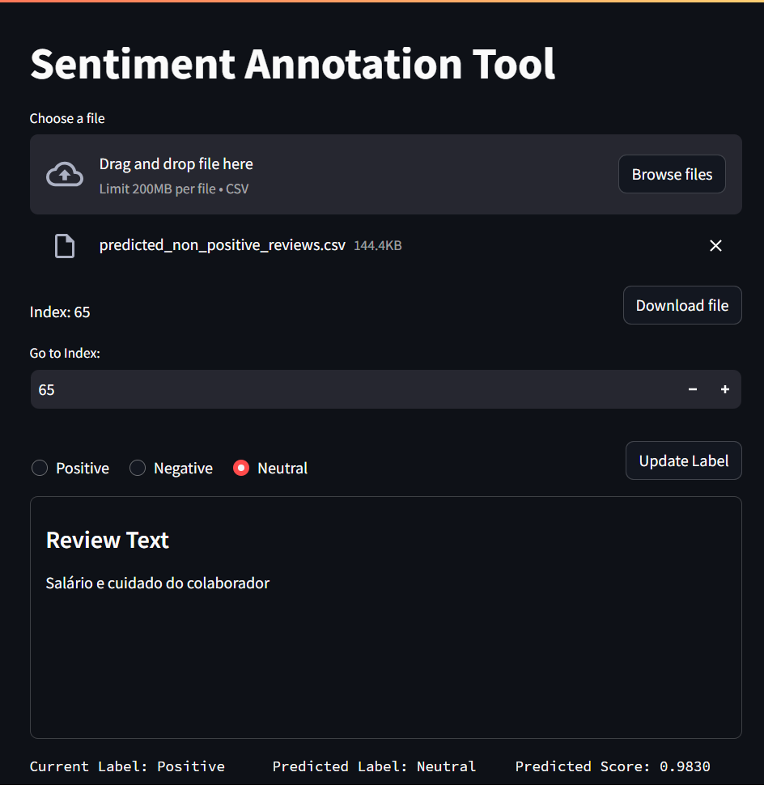

# Unveiling Sentiments: Exploring Glassdoor Reviews of IT Companies in Cuiabá through Natural Language Processing

In today's digital age, online platforms serve as powerful repositories of user-generated content, offering invaluable insights into consumer experiences and sentiments. Among these platforms, Glassdoor stands out as a prominent hub for employee reviews, providing a wealth of feedback on companies from individuals across various industries.

In this project, we embark on a journey to explore and analyze Glassdoor reviews of Information Technology (IT) companies located in Cuiabá, Brazil. Leveraging the vast potential of Natural Language Processing (NLP) techniques, we aim to unearth hidden patterns, sentiments, and trends embedded within these reviews.

Our endeavor is divided into several key phases:

## Data Mining
The Data Mining process, facilitated by [scraper.ipynb](/data_mining/scraper.ipynb), involves the systematic downloading of HTML review pages from Glassdoor for a predefined list of Companies. Due to the absence of a public API for extracting reviews data from Glassdoor, the `Selenium` web automation tool was utilized. This process entails navigating to each review page and downloading its HTML content, with careful consideration given to incorporating delays between requests to circumvent potential blocking mechanisms imposed by Glassdoor.

The collected HTML pages serve as the raw material for subsequent data extraction and analysis steps, enabling the generation of valuable insights into employee sentiments and company reputations.

## Data Preparation

### Data Extraction
The Data Extraction process, facilitated by [data_preparation.ipynb](/data_preparation/data_preparation.ipynb), reads the HTML files downloaded in the previous section to extract reviews and transform them into a structured dataset. The resulting dataset contains the following columns:

- **review_id:** Glassdoor Review ID
- **company:** Company Name
- **employee_role:** Employee Role
- **employee_detail:** Details about the employee, including current employment status and duration
- **review_text:** Review Text
- **review_date:** Review Date
- **star_rating:** Star ratings given by the employee to the company
- **sentiment:** The sentiment of the review (1 for positive, 0 for neutral, -1 for negative)

This process enables the organization and analysis of reviews for further insights and decision-making.

### Data Conversion
The Data Conversion process utilizes the [data_conversion.ipynb](/data_preparation/data_conversion.ipynb) notebook to predict the sentiment of reviews using the [citizenlab/twitter-xlm-roberta-base-sentiment-finetunned](https://huggingface.co/citizenlab/twitter-xlm-roberta-base-sentiment-finetunned) model.

This classification is crucial for reviews that do not fit into the categories of purely positive or negative. Since Glassdoor only offers these two options for classifying reviews, predicting sentiments ensures that all reviews are appropriately categorized.

### Data Merge
The Data Merge process involves merging annotated sentiments with the extracted sentiments. This task is facilitated by the [data_merge.ipynb](/data_preparation/data_merge.ipynb) notebook.

By combining annotated sentiments, manually reviewed using the Sentiment Annotation Tool, with the initially extracted sentiments, the dataset achieves improved accuracy and reliability in sentiment classification.

### Sentiment Annotation Tool
In the [Sentiment Annotation Tool](/data_preparation/annotation_tool.py), predictions from the previous section undergo human review. This tool, built with Streamlit, empowers users to:

- View each review alongside its current sentiment (extracted from Glassdoor) and the sentiment classified by [citizenlab/twitter-xlm-roberta-base-sentiment-finetunned](https://huggingface.co/citizenlab/twitter-xlm-roberta-base-sentiment-finetunned).
- Modify the sentiment of each review as needed, classifying them as:
  - Positive
  - Negative
  - Neutral
- Download the updated dataset with corrected sentiment labels.

## Data Visualization

#### Review Text Length Histogram
- Histogram showing the distribution of review text lengths.

#### Token Frequency
- Histogram displaying the frequency distribution of tokens in the review text.
- Boxplot visualizing the spread of token frequencies.

#### Review Word Counts Histogram
- Histogram illustrating the distribution of word counts in the review text.

#### Review Average Word Length
- Visualization depicting the average length of words used in the reviews.

#### Most Frequently Stop Words
- Chart showcasing the most frequently occurring stop words in the reviews.

#### Most Frequently Non-Stop Words
- Chart displaying the most frequently occurring non-stop words in the reviews.

#### N-Grams
- Visualization highlighting the most common n-grams (sequences of words) in the reviews.

#### Wordcloud
- Wordcloud representation of the most common words used in the reviews.

#### Sentiment Distribution
- Visualization displaying the distribution of sentiment labels (e.g., positive, negative, neutral) in the dataset.
